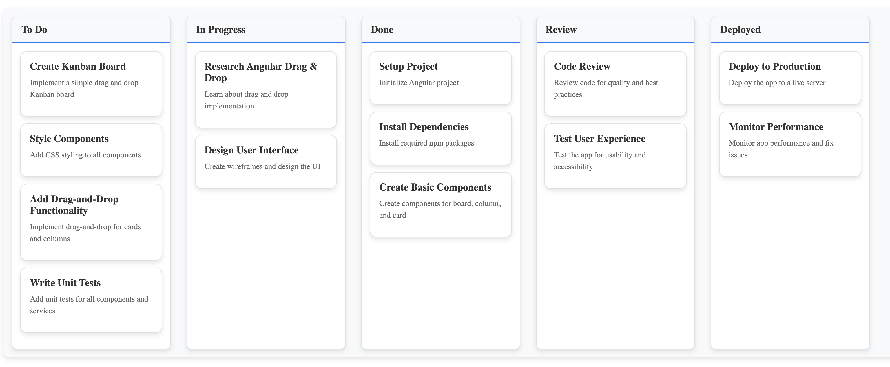

# Ng-Kanban

A lightweight and customizable Kanban board library for Angular applications, built with standalone components.



## Features
- Drag-and-drop functionality for cards and columns.
- Customizable card and column templates.
- Built with Angular standalone components for easy integration.

## Installation

Install the library via npm:

```bash
npm install ng-kanban